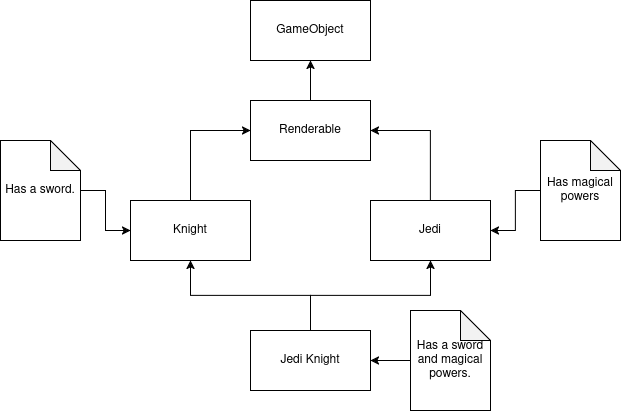

# 2D Game Engine for Embedded Systems

This project focuses on developing a 2D Game engine for low-cost embedded systems. It is part of my bachelor's degree paper.
My implementation is based on RP2040 microcontroller found on boards like Raspberry Pi Pico and Marble Pico.

## Usage

### 1. Prerequisites
Before using the engine, make sure you have the following installed:

- Raspberry Pi Pico SDK
- CMake
- ARM GCC Toolchain
- Ninja
- VS Code Raspberry Pi Pico Extension (optional)

### 2. Cloning the Repository

    git clone https://github.com/iosifvieru/pico-game-engine.git
    cd pico-game-engine

### 3. Building the project
Before building the project:
- Hold the BOOTSEL button on the Pico.
- Plug it into your computer via USB.

Run the following script to build the project:
    
    ./build-pico.sh

If for some reason you don't have permission try using:

    sudo ./build-pico.sh

This script will:
- Initialize CMake.
- Build the project using the Pico SDK.
- Generate a .uf2 file for flashing.
- Flash the .uf2 file to your Pico.
- Restart the pico and start running the new code.

You can alternatively use the VS Code Raspberry Pi Pico Extension to do all this with just a click.

## Hardware setup
### **Marble Pico**
Marble Pico is a development board based on RP2040 produced by Raspberry Pi. It is fully compatible with Raspberry Pi Pico (the board has the same pinout as pico) but it has some upgrades such as:
- USB type C (Pico has micro USB)
- microSD Card adaptor
- 8 MB of QSPI Flash (as opposed to 2MB on Pi Pico)
- I2C 3v3 connector

**General pin functions**:
- `VBUS` - the input voltage on the board from the USB cable. This pin can be used to power the board from a 5V DC external source.
- `VSYS` - if the board is powered by USB, this pin can be used as a power source for other modules. 200mA - peak current consumption.
- `3V3` - a 3.3V power source generated by the onboard voltage regulator.
- `GND` - ground pin
- `ADC_VREF`: reference voltage for ADC conversion.
- `GPIO Pins`: 25 pins for input and output. Note that GPIO15 has a *special function during board reset* on Marble Pico.

Pinout schematic can be found [here](https://github.com/GroundStudio/GroundStudio_Marble_Pico/blob/main/Documentation/REV0.0.3/RLJDMV_GS%20REV0.0.3%20GroundStudio%20Marble%20Pico%20Pinout%20REV%201.1.pdf).
Official Marble Pico repo: [here](https://github.com/GroundStudio/GroundStudio_Marble_Pico).

### **RP2040**
RP2040 is a 32-bit dual ARM Cortex-M0+ microcontroller produced by Raspberry Pi Ltd.
This project is written in C++ but the microcontroller can also be programmed in MicroPython, Assembly, Rust, Go.

- Key features:
    - Dual ARM Cortex-M0+ cores 133Mhz.
    - 264 KB SRAM 
    - 30 GPIO Pins
    - Two UART controllers
    - Two SPI controllers
    - 16 PWM Channels.

The RP2040 Datasheet can be found [here](https://datasheets.raspberrypi.com/rp2040/rp2040-datasheet.pdf).

### **ST7735**
ST7735 is a TFT LCD Display that I have used in my implementation. It supports 18, 16 and 12 bit colors and features 128x128 resolution.

- Key features:
    - TFT LCD display type.
    - 128x128 pixel resolution (there are also 128x160 pixel resolution variants)
    - 18, 16 or 12-bit color depth. My implementation uses 16-bit color depth.
    - SPI communication.
    - it operates at 3.3V but it can also be used at 5V.

The ST7735 Datasheet can be found [here](https://www.displayfuture.com/Display/datasheet/controller/ST7735.pdf).

### Pin Connections

| Marble Pico / Raspberry Pi Pico | Display (ST7735) |
|------------------|------------------|
| 3.3V             | VCC              |
| GND              | GND              |
| GPIO18             | SCK              |
| GPIO19             | MOSI             |
| GPIO20             | DC               |
| GPIO21             | RESET            |
| GPIO17             | CS               |

Buttons can be connected at any GPIO pin then configure them in software.

## Software documentation

### 1. Rendering

#### UML Diagram

The rendering logic is separated in two main components:
1. **Canvas** - handles the drawing operation.
1. **Display** - the display driver provides a `flush` method to transfer the buffer to the screen.

These two interfaces are then incapsulated in a RenderSystem.

You can then write your own driver by implementing the _Display_ interface. In this project the ST7735 class does exactly that. I consider this version a great approach because it provides a layer of abstraction between the actual hardware and the software implementation.

Example of `flush` implementation:

    void ST7735::flush(const uint16_t* buffer){
        static uint8_t bf[ST7735_WIDTH * ST7735_HEIGHT * 2];
        uint8_t *bf_ptr = bf;

        /* populating the bf with the pixel data in the correct order. */
        for (int i = 0; i < ST7735_HEIGHT * ST7735_WIDTH; i++) {
            *bf_ptr++ = buffer[i] >> 8;
            *bf_ptr++ = buffer[i];
        }

        this->set_cs(0);
        this->set_dc(1);

        /* sending all of the data once. */
        spi_write_blocking(spi0, bf, sizeof(bf));

        this->set_cs(1);
    }

To optimize rendering and avoid flickering a double buffered canvas is used. All the drawing operations are made in a back buffer and only the front buffer is rendered to the screen. On the next frame these two are swapped.

Example of drawing a pixel to canvas:

    void BufferedCanvas::set_pixel(uint16_t x, uint16_t y, uint16_t color) {
        if(x >= width || x <= 0){
            return;
        }
        if(y >= height || y <= 0){
            return;
        }

        this->back_buffer[y * width + x] = color;
    }

### 2. Input

#### UML Diagram

The `Input` interface defines three methods for handling any sort of input.

- `config(button_pin: uint8_t): void` - configures a specific button pin.
- `is_pressed(button_pin: uint8_t): bool` - returns a boolean with the state of a given pin (pressed or not).
- `is_pressed_once(button_pin: uint8_t): bool` - ensures that a button was pressed only once. (handles debouncing).

Keyboard implements `Input` and it ensures there is only one instance of that object (it is a Singleton).

Example of usage:
    
    #define A 8
    #define D 14
    #define W 13
    #define S 15
    ...

    Keyboard& keyboard = Keyboard::getInstance();

    keyboard.config(A);
    keyboard.config(S);
    keyboard.config(W);
    keyboard.config(D);

    ...
    if(keyboard.is_pressed_once(A)){
        /* logic here. */
    }

    if(Keyboard::getInstance().is_pressed(S)){
        /* logic here */
    }

### 3. Engine

In *object-oriented programming* (OOP), a classic issue is the famous *diamond problem*. It occurs when a class inherits from two classes that both inherit from the same base class creating ambiguity about which base class implementation should be used.

The example above provides an example that further explains the diamond problem, we have a *GameObject* base class that is inherited by a *Renderable* class that adds the rendering capabilities. *Knight* and *Jedi* are two classes that inherit the *Renderable* class, each object adding it's own functionality. *Knight* - weilds a sword, *Jedi* - has magical powers. Now, if we want to create a *Jedi Knight* class that combines both functionalities a diamond-shaped structure is created which leads to ambiguity.
In order to fix this, the OOP approach is to rely on *interfaces and composition*, but these solutions sometimes struggle with scalability in complex projects or video games.
An "anti OOP" way to solve the issue is by using an *Entity-Component-System* (ECS) architecture. Instead of using class hierarchies, ECS favours composition over inheritence. This approach breaks down *GameObjects* in three key components:
- *Entity* - a container that represents the game objects, it does not have any logic or behaviour.
- *Component* - a structure that holds data, it does not have any logic or behaviour.
- *System* - a process that modifies all entities with the desired components.
Using this approach, the logic of an entity can be changed at runtime, it also removes the ambiguity of deep hierarchies.

Having this in mind, I wrote my own implementation for an ECS. Let's break it down:

#### Entity

- `std::vector<Component*> components` - holds the components dinamically.
- `add_component()`,  `remove_component()` - procedures to manage components.
- `get_component()`, `has_component()` - gets and check for components.

Example of usage:
    
    // this will create a renderable entity at (10, 20) with a 16x16 texture called player_texture;
    Entity* e = new Entity();
    e->add_component(new PositionComponent(10, 20));
    e->add_component(new SpriteComponent(16, 16, player_texture));
    
#### Component

- `shared: bool` - indicates whether the component is shared between multiple entities or not.
- `get_component_name(): const char*` - returns the name of the component.
- `make_shared(shared: bool): void` - marks the component as shared.
- `is_shared(): bool` - returns if a component is shared or not.

This interface is implemented by *PositionComponent* (stores the position of an entity), *VelocityComponent* (defines the movement speed), *SpriteComponent* (containes the entity's texture). To create your component implement this interface.

#### System

The System interface has an update function that accepts entities, iterates through all of them and modify their data. To create your own system implement the interface.

Example of a system:

    void MovementSystem::update(const std::vector<Entity*>& entities){
        for(const auto& entity: entities){
            VelocityComponent* velocity = (VelocityComponent*)(entity->get_component("VelocityComponent"));
            if(velocity == nullptr) continue;
            
            PositionComponent* p = (PositionComponent*) (entity->get_component("PositionComponent"));
            if(p == nullptr) continue;

            /* normalization for diagonal movement */
            if (velocity->v_x != 0 && velocity->v_y != 0) {
                float magnitude = std::sqrt(velocity->v_x * velocity->v_x + velocity->v_y * velocity->v_y);

                if (magnitude > 1.0f) {
                    velocity->v_x /= magnitude;
                    velocity->v_y /= magnitude;
                }
            }
            
            p->x += velocity->v_x;
            p->y += velocity->v_y; 
        }
    }

#### Engine

The ECS is incapsulated within the `Engine` class, a Singleton object that centralizes entities and systems.

- `add_entity(Entity* entity)` / `remove_entity(Entity* entity)` - adds / removes an entity.
- `add_system(System* system)` / `remove_system(System* system)` - adds / removes a system.
- `update()` - iterates through all the systems and calls their update function with the entity list.

Example of usage:

    Engine::getInstance().add_system(new MovementSystem());

    // creates an entity at (10, 20) with a 16x16 texture and a velocity component with v_x = 1 (the object has a horizontal movement);
    Entity* e = new Entity();
    e->add_component(new PositionComponent(10, 20));
    e->add_component(new SpriteComponent(16, 16, player_texture));
    e->add_component(new VelocityComponent(1, 0));

    Engine::getInstance().add_entity(e);
    
    /* game loop */
    while(true) {
        Engine::getInstance().update();
    }

### 4. Random

Pseudorandom number generator found [here](https://forums.raspberrypi.com/viewtopic.php?t=302960).

### 5. Texture Manager

TextureManager handles sprite extraction from a large bitmap spritesheet. It can extract a specific tile from the whole texture.

Example of usage:

    TextureManager* t = new TextureManager(spritesheet, spritesheet_width, spritesheet_height, tile_width, tile_height);

    const uint16_t* player_texture = t->get_tile(0);
    const uint16_t* coin_texture = t->get_tile(3);
    ...
